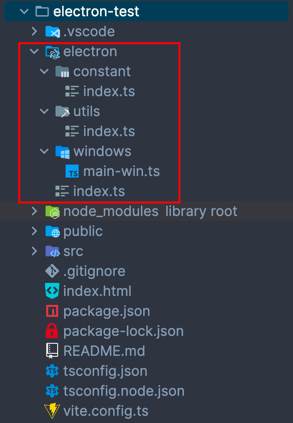

#### 初始化项目

使用 vite 初始化 vue3 项目：

```yaml
npm create vite@latest

cd electron-demo # 进入刚刚创建的项目目录

npm i # 安装项目依赖
```

#### 安装 electron、electron-builder

```yaml
npm i electron electron-builder -D
```

如果安装失败，可以尝试使用如下方式进行安装：

```yaml
npm install -g cnpm --registry=https://registry.npmmirror.com

cnpm i electron electron-builder -D
```

#### 配置 electron 开发环境

当使用 electron 加 vue3 进行开发时，如果不进行开发配置，需要在启动 vue 项目时，另开一个终端，单独启动 electron，同时在更改主进程代码时，窗口不会自动刷新，需要终结掉之前的 electron 启动进程，重新启动才能获取到最新的主进程更改。

为了方便开发，可以安装 `vite-plugin-electron` 和 `vite-plugin-electron-renderer` 这两个插件：

```yaml
npm i vite-plugin-electron vite-plugin-electron-renderer -D
```

- vite-plugin-electron：这个插件可以在启动 vue 项目时，自动启动 electron 项目。该插件会在项目根目录下自动创建一个名为 `dist-electron/index.js` 的文件，这个文件就是它对 electron 主进程打包后的产物，用于 electron 的运行。也就是说，`dist-electron/index.js` 需要配置在 `package.json` 的 `main` 属性上：

```json
{
  // ...
  "main": "dist-electron/index.js",
  "scripts": {
    // ...
  }
}
```

- vite-plugin-electron-renderer：这个插件是用于 electron 主进程代码的热更新，即在更改主进程代码之后，窗口会自动刷新。

插件具体使用方式如下：

```js
import path from 'path';
import {defineConfig} from 'vite';
import vue from '@vitejs/plugin-vue';
import electron from 'vite-plugin-electron';
import electronRender from 'vite-plugin-electron-renderer';

export default defineConfig({
  base: '/',
  plugins: [
    vue(),
    electron({
      entry: 'electron/index.ts' // 这个是 electron 主进程的入口文件
    }),
    electronRender()
  ]
});
```

配置好上述插件之后，就可以在项目根目录下创建 `electron/index.ts` 文件作为主进程的入口文件，具体内容如下：

```ts
import {app, BrowserWindow, ipcMain} from 'electron';

// 屏蔽浏览器控制台警告
process.env.ELECTRON_DISABLE_SECURITY_WARNINGS = 'true';

export const createMainWindow = () => {
  const win = new BrowserWindow({
    width: 800,
    height: 550,
    minWidth: 800,
    minHeight: 550,
    webPreferences: {
      /**
       * - 将 contextIsolation 设置为 true 启用上下文隔离，这意味着每个渲染进程都拥有自己的上下文环境。
       *   也就是说不能直接在渲染进程中使用 ipcRenderer 与主进程进行通信。
       *
       * - 如果想要直接在渲染进程中使用 ipcRenderer 与主进程进行通信，就需要将 contextIsolation 设置为 false。
       **/
      contextIsolation: false,
      // 是否支持使用 node 模块
      nodeIntegration: true
    }
  });

  // 开启调试工具
  win.webContents.openDevTools();

  win.loadURL('http://localhost:5173');
};

app.whenReady().then(createMainWindow);
```

#### 主进程与渲染进程通信示例

在 electron 主进程代码中增加 ipc 通信代码，具体如下设置：

```js
import {app, BrowserWindow, ipcMain} from 'electron';

// 屏蔽浏览器控制台警告
process.env.ELECTRON_DISABLE_SECURITY_WARNINGS = 'true';

export const createMainWindow = () => {
  const win = new BrowserWindow({
    width: 800,
    height: 550,
    minWidth: 800,
    minHeight: 550,
    webPreferences: {
      /**
       * - 将 contextIsolation 设置为 true 启用上下文隔离，这意味着每个渲染进程都拥有自己的上下文环境。
       *   也就是说不能直接在渲染进程中使用 ipcRenderer 与主进程进行通信。
       *
       * - 如果想要直接在渲染进程中使用 ipcRenderer 与主进程进行通信，就需要将 contextIsolation 设置为 false。
       **/
      contextIsolation: false,
      // 是否支持使用 node 模块
      nodeIntegration: true
    }
  });

  // 监听渲染进程发送的消息
  ipcMain.handle('test', (e, value) => {
    console.log(value);
    // 向渲染进程发送消息
    e.sender.send('main-test', 'main send message: ' + value);
  });

  // 开启调试工具
  win.webContents.openDevTools();

  win.loadURL('http://localhost:5173');
};

app.whenReady().then(createMainWindow);
```

在渲染进程中增加 ipc 通信代码，以 `App.vue` 为例，具体如下：

```vue

<script setup lang="ts">
  import {ipcRenderer} from 'electron';
  import {ref} from 'vue';

  const message = ref('');
  const count = ref(0);

  // 向主进程发送消息
  const onEmit = () => {
    ipcRenderer.invoke('test', count.value++);
  };

  // 接受主进程发送的消息
  ipcRenderer.on('main-test', (_, value) => {
    console.log(value, 'value');
    message.value = value;
  });
</script>

<template>
  <div>
    <a href="https://vitejs.dev" target="_blank">
      
    </a>
    <a href="https://vuejs.org/" target="_blank">
      
    </a>
    <p>{{ message }}</p>
    <button @click="onEmit">通信</button>
  </div>
</template>

<style scoped>
  .logo {
    height: 6em;
    padding: 1.5em;
    will-change: filter;
    transition: filter 300ms;
  }

  .logo:hover {
    filter: drop-shadow(0 0 2em #646cffaa);
  }

  .logo.vue:hover {
    filter: drop-shadow(0 0 2em #42b883aa);
  }
</style>
```

如果不需要采用 `preload` 统一管理渲染进程与主进程的通信，而直接在渲染进程中采用 `ipcRenderer` 与主进程进行通信，那么到这一步，你就可以快乐的进行功能的 coding 了。

如果想更安全且集中的进行主进程与渲染进程的通信，那么使用上述方式是满足不了的，需要在主进程中增加 `preload` 配置。

#### 配置 preload

在项目根目录下创建 `preload/index.ts` 文件，具体内容如下：

```ts
import {contextBridge, ipcRenderer} from 'electron';

const sendMethods = {
  sendTest: (count: number) => {
    ipcRenderer.send('test', count);
  }
};

const onMethods = {
  onGetTest: (cb: (value: string) => void) => {
    // 监听事件前，先移除上一次的监听，防止监听多次
    ipcRenderer.removeAllListeners('info');
    ipcRenderer.on('main-test', (e, value) => cb(value));
  }
};

contextBridge.exposeInMainWorld('electronApi', {
  ...sendMethods,
  ...onMethods
});
```

由于采用了 typescript 进行 preload 的编写，而 electron 运行时是不接受 typescript 的，因此在代码执行前需要将 preload/index.ts 编译为 js 才能运行，而之前的插件 `vite-plugin-electron` 无法将 `preload/index.vue` 打包TODO

在项目根目录下创建 `plugins` 文件夹，并在该文件夹内分别创建：`vite.common-config.ts`、`vite-electron-plugin.ts`、`vite-electron-build-plugin.ts` 三个文件，其内容分别为：

- vite.common-config.ts 内容如下：

```js
export const buildConfig = () => {
  // 因为 vite 本身就是通过 esbuild 进行编译的，因此可以直接导入 esbuild
  require('esbuild').buildSync({
    entryPoints: ['electron/index.ts'],
    bundle: true,
    outfile: 'dist/main.js',
    platform: 'node',
    target: 'node12',
    external: ['electron']
  });
  // 编译 preload
  require('esbuild').buildSync({
    entryPoints: ['preload/index.ts'],
    bundle: true,
    outfile: 'dist/preload.js',
    platform: 'node',
    target: 'node12',
    external: ['electron']
  });
};
```

- vite-electron-plugin.ts 该插件是为了能在 `npm run dev` 启动 vue 时，能够同时启动 electron，而不需要单独使用 `electron .` 启动 electron：

```ts
import fs from 'fs';
import path from 'path';
import {spawn} from 'child_process';
import type {ChildProcessWithoutNullStreams} from 'child_process';
import type {Plugin} from 'vite';
import type {AddressInfo} from 'net';
import {buildConfig} from './vite.common-config';

const getTimer = () => {
  const now = new Date();
  const hours = now.getHours();
  const minutes = now.getMinutes();
  const seconds = now.getSeconds();
  return `${hours}时${minutes}分${seconds}秒`;
};

// 获取 electron 日志
const getLog = (data: Buffer) => {
  // 判断 data 是否有值
  if (data.length > 2) {
    console.log(`Log(${getTimer()}): ${data}`);
  }
};

// 监听文件夹中文件的变化，重新打包启动
const watchFolderFilesChange = (folderPath: string, electronProcess: ChildProcessWithoutNullStreams, IP: string) => {
  // 遍历文件夹
  fs.readdir(folderPath, (err: NodeJS.ErrnoException | null, files: string[]) => {
    if (err) {
      console.error('Error reading directory:', err);
      return;
    }
    files.forEach((file) => {
      const filePath = path.join(folderPath, file);
      // 检查文件状态
      fs.stat(filePath, (err: NodeJS.ErrnoException | null, stats: fs.Stats) => {
        if (err) {
          console.error('Error getting file stats:', err);
          return;
        }
        // 如果是文件夹，则递归遍历
        if (stats.isDirectory()) {
          watchFolderFilesChange(filePath, electronProcess, IP);
        } else {
          // 监听文件变化
          fs.watchFile(filePath, (curr: fs.Stats, prev: fs.Stats) => {
            if (curr.mtimeMs !== prev.mtimeMs) {
              // 杀死当前的Electron进程
              electronProcess.kill();
              // 重新编译主进程代码并重新启动Electron进程
              buildConfig();
              electronProcess = spawn(require('electron') as any, ['dist/main.js', IP]);
              // 监听Electron进程的stdout输出
              electronProcess.stdout?.on('data', getLog);
            }
          });
        }
      });
    });
  });
};

export const viteElectronPlugin = (): Plugin => {
  return {
    name: 'vite-electron-plugin',
    // 在configureServer中实现插件的逻辑
    configureServer(server) {
      // 调用初始化Electron函数
      buildConfig();
      // 监听Vite的HTTP服务器的listening事件
      server?.httpServer?.once('listening', () => {
        // 获取HTTP服务器的监听地址和端口号
        const addressInfo = server?.httpServer?.address() as AddressInfo;
        const IP = `http://localhost:${addressInfo.port}`;
        // 启动Electron进程
        let electronProcess: ChildProcessWithoutNullStreams = spawn(require('electron') as any, ['dist/main.js', IP]);
        // 监听文件夹变化，重新编译 electron 代码
        watchFolderFilesChange('electron', electronProcess, IP);
        // 监听 preload 代码的更改
        fs.watchFile('preload/index.ts', () => {
          // 杀死当前的Electron进程
          electronProcess.kill();
          // 重新编译主进程代码并重新启动Electron进程
          buildConfig();
          electronProcess = spawn(require('electron') as any, ['dist/main.js', IP]);
          // 监听Electron进程的stdout输出
          electronProcess.stdout?.on('data', getLog);
        });
        // 监听Electron进程的stdout输出
        electronProcess.stdout?.on('data', getLog);
      });
    }
  };
};
```

#### 初始化 Electron

在项目根目录下创建 `electron` 文件夹（文件夹名称可以自行更改），文件目录如下：



- index.ts 内容如下：

```js
import path from 'path';
import {app, Tray} from 'electron';
import {createMainWindow} from './windows/main-win';
import {isDev, isMac, getIconPath, createContextMenu} from './utils';
import {globalInfo} from './constant';

// 屏蔽警告
process.env.ELECTRON_DISABLE_SECURITY_WARNINGS = 'true';

// 解决 http 下无法使用媒体api（navigator.mediaDevices.getUserMedia）的问题
app.commandLine.appendSwitch('unsafely-treat-insecure-origin-as-secure', 'http://localhost:5173');

// 限制只能启动一个应用
const gotTheLock = app.requestSingleInstanceLock();

// 判断是否是 mac
if (!isMac) {
  if (!gotTheLock) {
    app.quit();
  } else {
    app.on('second-instance', (event, commandLine, workingDirectory) => {
      if (globalInfo.mainWin) {
        if (globalInfo.mainWin?.isMinimized()) globalInfo.mainWin?.restore();
        globalInfo.mainWin?.focus();
        globalInfo.mainWin?.show();
      }
    });
  }
}

app
  .whenReady()
  .then(createMainWindow)
  .then(() => {
    globalInfo.tray = new Tray(path.join(__dirname, getIconPath()));
    // 设置鼠标悬浮 Tip 提示
    globalInfo.tray?.setToolTip('dnhyxc');
    if (!isMac) {
      // 设置托盘菜单
      globalInfo.tray?.setContextMenu(createContextMenu());
      globalInfo.tray?.on('click', () => {
        globalInfo.mainWin?.show();
      });
    } else {
      globalInfo.tray?.on('mouse-up', () => {
        globalInfo.mainWin?.show();
      });
    }
  });

// 设置mac扩展坞图标
if (isMac) {
  app.dock.setIcon(path.join(__dirname, isDev ? '../public/mac/favicon.ico' : './mac/favicon.ico'));
}

// 当窗口开始活动时触发
app.on('activate', () => {
  if (globalInfo.mainWin === null) {
    createMainWindow();
  }
  // 点击拓展坞显示应用窗口
  if (globalInfo.mainWin && isMac) {
    globalInfo.mainWin?.show();
  }
});
```

- windows/main-win.ts 内容如下：

```js
import path from 'path';
import {ipcMain, BrowserWindow, IpcMainEvent} from 'electron';
import {globalInfo} from '../constant';
import {getIconPath, isMac} from '../utils';

let timer: ReturnType<typeof setTimeout> | null = null;

export const createMainWindow = () => {
  globalInfo.mainWin = new BrowserWindow({
    width: 800,
    height: 550,
    minWidth: 800,
    minHeight: 550,
    titleBarStyle: 'hidden',
    webPreferences: {
      nodeIntegration: false,
      contextIsolation: true, // 这里需要设置为 true， 否则导入 preload.js 会报错
      preload: path.join(__dirname, './preload.js'),
      // 如果是开发模式可以使用devTools 调试
      // devTools: process.env.NODE_ENV === 'development' || config.build.openDevTools,
      // 在macos中启用滚动回弹效果
      scrollBounce: process.platform === 'darwin'
    },
    // 设置 transparent 会导致 win.restore() 失效
    // transparent: true, // 当transparent为true会导致win.restore()无效
    icon: path.join(__dirname, getIconPath())
  });

  // 禁止右键开启右键菜单
  if (!isMac) {
    globalInfo.mainWin?.hookWindowMessage(278, function (e) {
      if (timer) {
        clearTimeout(timer);
        timer = null;
      }
      globalInfo.mainWin?.setEnabled(false); //窗口禁用
      timer = setTimeout(() => {
        globalInfo.mainWin?.setEnabled(true);
      }, 100); //延时太快会立刻启动，太慢会妨碍窗口其他操作，可自行测试最佳时间
      return true;
    });
  }

  globalInfo.mainWin?.webContents.openDevTools();

  globalInfo.mainWin?.loadURL('http://localhost:5173');
};

ipcMain.on('test', (e: IpcMainEvent, status: string) => {
  console.log(status, 'test');
  e.sender.send('test', 'main win send message to render: ' + status);
});

ipcMain.on('info', (e: IpcMainEvent, status: number) => {
  console.log(status, 'info');
  e.sender.send('info', {id: status, title: 'Electron Vue3 template'});
});

ipcMain.on('win-min', () => {
  globalInfo.mainWin?.minimize();
});

ipcMain.on('win-max', (e: IpcMainEvent) => {
  if (globalInfo.mainWin?.isMaximized()) {
    globalInfo.mainWin?.restore();
  } else {
    globalInfo.mainWin?.maximize();
  }
  e.sender.send('win-max', globalInfo.mainWin?.isMaximized());
});

ipcMain.on('win-close', () => {
  globalInfo.mainWin?.hide();
});
```

- utils/index.ts 内容如下：

```js
import {Menu, app} from 'electron';
import {globalInfo} from '../constant';

export const isDev = process.env.NODE_ENV === 'development';

export const isMac = process.platform === 'darwin';

export const getIconPath = () => {
  if (isDev) {
    return isMac ? '../public/Template.png' : '../public/icon@2.png';
  } else {
    return isMac ? './Template.png' : './icon@2.png';
  }
};

export const clearGlobalInfo = () => {
  globalInfo.mainWin = null;
  globalInfo.tray = null;
};

export const createContextMenu = () => {
  // 托盘菜单
  return Menu.buildFromTemplate([
    {
      label: '显示墨客',
      click: () => {
        globalInfo.mainWin?.show();
      }
    },
    {
      label: '退出墨客',
      click: () => {
        clearGlobalInfo();
        app.quit();
      }
    }
  ]);
};
```

- constant/index.ts 内容如下：

```js
import {BrowserWindow, Tray} from 'electron';

export const globalInfo: {
  mainWin: BrowserWindow | null;
  tray: Tray | null;
} = {
  mainWin: null,
  tray: null
};
```

在 electron 文件目录内容设置完毕之后，在根目录下创建 `preload` 文件夹，同时在 preload 文件夹中创建 `index.ts` 文件，内容如下：

```js
import {contextBridge, ipcRenderer} from 'electron';

const sendMethods = {
  sendTest: (type: string) => {
    ipcRenderer.send('test', type);
  },
  sendInfo: (id: number) => {
    console.log(id, 'id222');
    ipcRenderer.send('info', id);
  },
  sendWinMin: () => {
    ipcRenderer.send('win-min');
  },
  sendWinMax: () => {
    ipcRenderer.send('win-max');
  },
  sendWinClose: () => {
    ipcRenderer.send('win-close');
  }
};

const onMethods = {
  onTest: (cb: (value: string) => void) => {
    // 移除之前添加的一次性监听器
    ipcRenderer.removeAllListeners('info');
    ipcRenderer.on('test', (e, value: string) => cb(value));
  },
  onGetInfo: (cb: (info: { id: number; title: string }) => void) => {
    // 移除之前添加的一次性监听器
    ipcRenderer.removeAllListeners('info');
    ipcRenderer.on('info', (e, info) => cb(info));
  },
  onWinMax: (cb: (status: boolean) => void) => {
    // 移除之前添加的一次性监听器
    ipcRenderer.removeAllListeners('info');
    ipcRenderer.on('win-max', (e, status) => cb(status));
  }
};

contextBridge.exposeInMainWorld('electronApi', {
  ...sendMethods,
  ...onMethods
});
```
